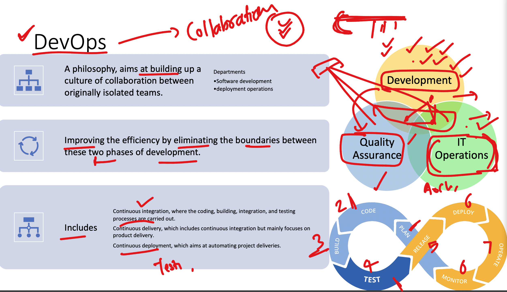
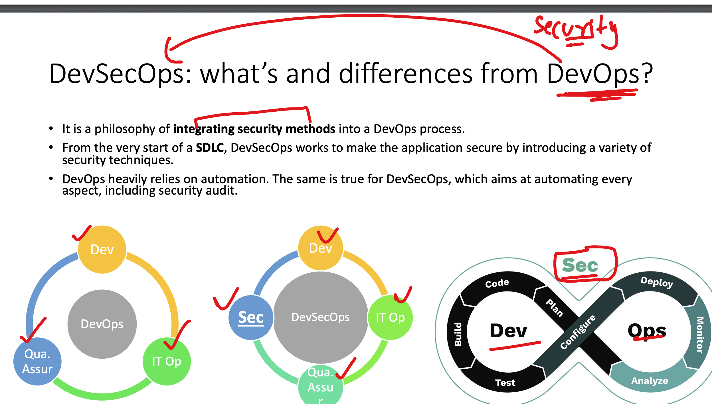
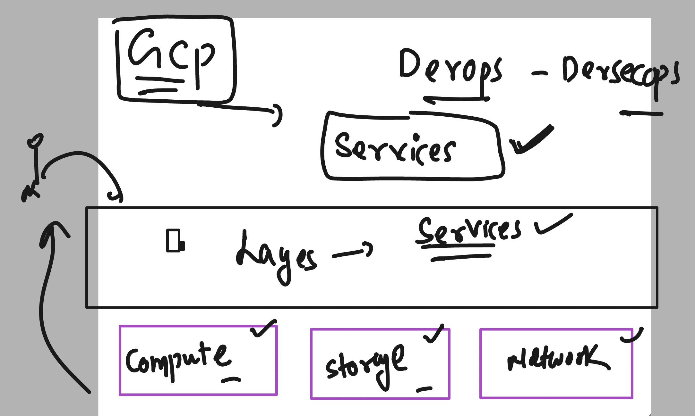
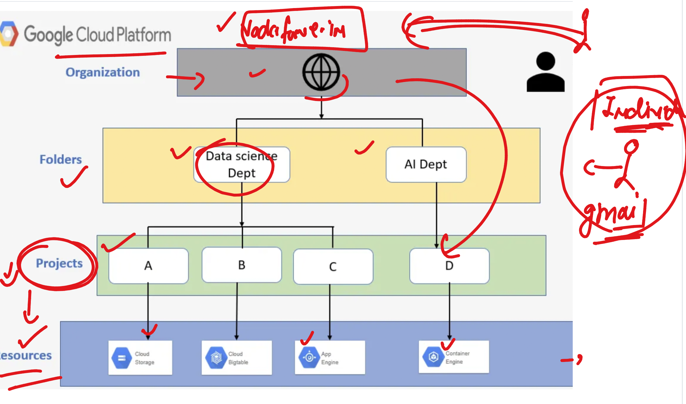
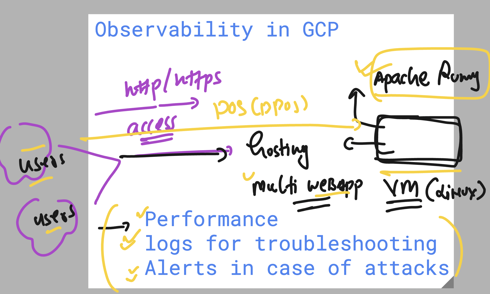
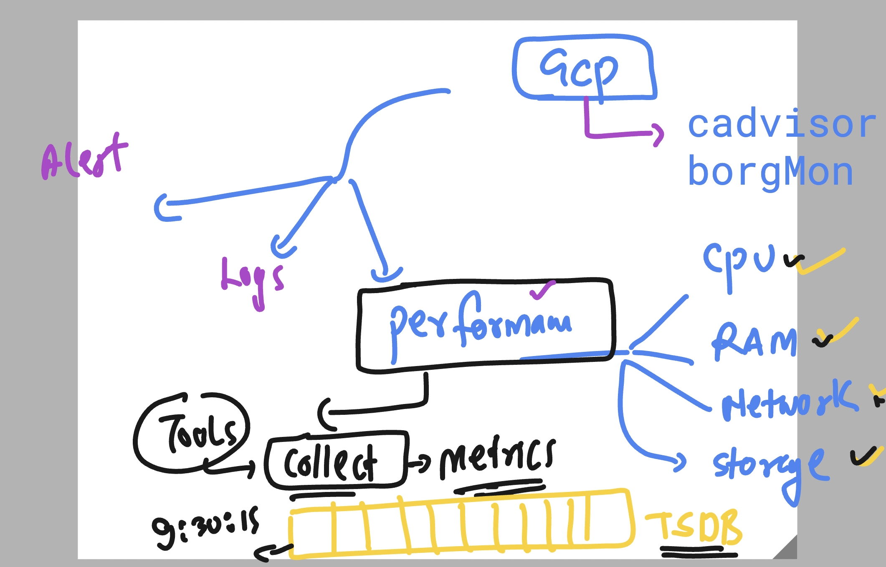
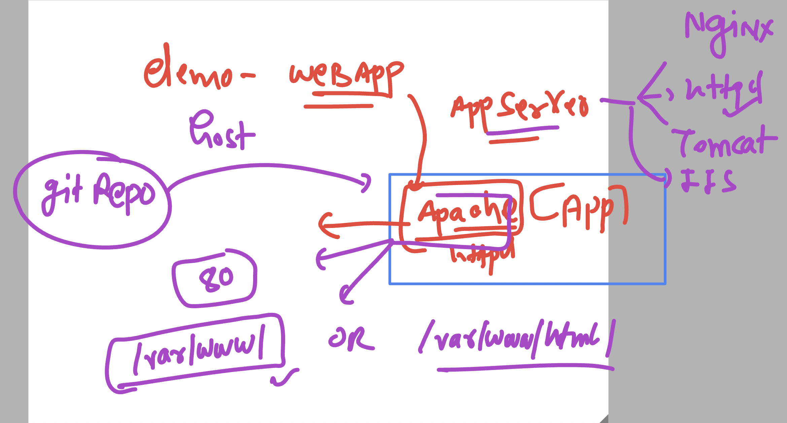

# vodafone_gcp_devsecops24thFeb2025

### Devops the Mindset



### Devops to DevSecOps



### Google cloud platform -- for Devops and Devsecops



### Google Cloud account basic info 



### Web app use case 



## Observability in app 

### Metrics for Performance monitoring 



### Few Gcp vm linux commands 

```sh
learntechbyme@gcp-common-vm:~$ whoami
learntechbyme
learntechbyme@gcp-common-vm:~$ ls /home
learntechbyme  somnathsalgar
learntechbyme@gcp-common-vm:~$ ls /home
learntechbyme  somnathsalgar
learntechbyme@gcp-common-vm:~$ ls /home
learntechbyme  pratikshasutar2032  somnathsalgar
learntechbyme@gcp-common-vm:~$ ls /home
ananthakumar_test  aniketkumbhar348921  learntechbyme  pradeepbhutare  pratikshasutar2032  shrishailraddi07  somnathsalgar
learntechbyme@gcp-common-vm:~$ who
learntechbyme pts/0        2025-02-24 07:24 (172.253.211.49)
somnathsalgar pts/1        2025-02-24 07:25 (172.253.211.49)
aniketkumbhar348921 pts/2        2025-02-24 07:25 (172.253.211.49)
pratikshasutar2032 pts/3        2025-02-24 07:26 (172.253.211.49)
ananthakumar_test pts/4        2025-02-24 07:26 (172.253.211.49)
shrishailraddi07 pts/5        2025-02-24 07:26 (172.253.211.49)
pradeepbhutare pts/6        2025-02-24 07:26 (172.253.211.49)
learntechbyme@gcp-common-vm:~$ 

```

### checking few details of cloudops agent 

```sh
learntechbyme@gcp-common-vm:~$ systemctl   status   google-cloud-ops-agent
● google-cloud-ops-agent.service - Google Cloud Ops Agent
     Loaded: loaded (/lib/systemd/system/google-cloud-ops-agent.service; enabled; preset: enabled)
     Active: active (exited) since Mon 2025-02-24 07:23:04 UTC; 5min ago
    Process: 1639 ExecStartPre=/opt/google-cloud-ops-agent/libexec/google_cloud_ops_agent_engine -in /etc/google-cloud-ops-agent/config.yaml (c>
    Process: 1687 ExecStart=/bin/true (code=exited, status=0/SUCCESS)
   Main PID: 1687 (code=exited, status=0/SUCCESS)
        CPU: 166ms

Feb 24 07:23:03 gcp-common-vm google_cloud_ops_agent_engine[1639]:   service:
Feb 24 07:23:03 gcp-common-vm google_cloud_ops_agent_engine[1639]:     pipelines:
Feb 24 07:23:03 gcp-common-vm google_cloud_ops_agent_engine[1639]:       default_pipeline:
Feb 24 07:23:03 gcp-common-vm google_cloud_ops_agent_engine[1639]:         receivers: [hostmetrics]
Feb 24 07:23:03 gcp-common-vm google_cloud_ops_agent_engine[1639]:         processors: [metrics_filter]
Feb 24 07:23:04 gcp-common-vm google_cloud_ops_agent_engine[1639]: 2025/02/24 07:23:04 [Ports Check] Result: PASS
Feb 24 07:23:04 gcp-common-vm google_cloud_ops_agent_engine[1639]: 2025/02/24 07:23:04 [Network Check] Result: PASS
Feb 24 07:23:04 gcp-common-vm google_cloud_ops_agent_engine[1639]: 2025/02/24 07:23:04 [API Check] Result: PASS
Feb 24 07:23:04 gcp-common-vm google_cloud_ops_agent_engine[1639]: 2025/02/24 07:23:04 Startup checks finished
Feb 24 07:23:04 gcp-common-vm systemd[1]: Finished google-cloud-ops-agent.service - Google Cloud Ops Agent.
learntechbyme@gcp-common-vm:~$ 
learntechbyme@gcp-common-vm:~$ 
learntechbyme@gcp-common-vm:~$ cd /opt/
learntechbyme@gcp-common-vm:/opt$ ls
google-cloud-ops-agent
learntechbyme@gcp-common-vm:/opt$ cd  google-cloud-ops-agent/
learntechbyme@gcp-common-vm:/opt/google-cloud-ops-agent$ ls
libexec  subagents
learntechbyme@gcp-common-vm:/opt/google-cloud-ops-agent$ 

```

### we can control ops agent  

```sh
 14  sudo systemctl   stop    google-cloud-ops-agent
   15  systemctl   status   google-cloud-ops-agent
   16  sudo systemctl   start    google-cloud-ops-agent
   17  systemctl   status   google-cloud-ops-agent
```

### Hosting a sample webUI app in gcp linux vm using apache web server



## setting up apache2 on Ubuntu machine 


### loging to root user 

```sh
learntechbyme@gcp-common-vm:~$ sudo -i 
root@gcp-common-vm:~# 
root@gcp-common-vm:~# apt update
Get:1 file:/etc/apt/mirrors/debian.list Mirrorlist [30 B]
Get:2 file:/etc/apt/mirrors/debian-security.list Mirrorlist [39 B]                    
Hit:7 https://packages.cloud.google.com/apt google-compute-engine-bookworm-stable InRelease
Hit:8 https://packages.cloud.google.com/apt cloud-sdk-bookworm InRelease
Hit:3 https://deb.debian.org/debian bookworm InRelease 
Hit:4 https://deb.debian.org/debian bookworm-updates InRelease
Hit:5 https://deb.debian.org/debian bookworm-backports InRelease
Hit:6 https://deb.debian.org/debian-security bookworm-security InRelease
Hit:9 https://packages.cloud.google.com/apt google-cloud-ops-agent-bookworm-2 InRelease
Reading package lists... Done
Building dependency tree... Done
Reading state information... Done
7 packages can be upgraded. Run 'apt list --upgradable' to see them.
root@gcp-common-vm:~# 
root@gcp-common-vm:~# apt install apache2
Reading package lists... Done
Building dependency tree... Done
Reading state information... Done
The following additional packages will be installed:
  apache2-bin apache2-data apache2-utils libapr1 libaprutil1 libaprutil1-dbd-sqlite3 libaprutil1-ldap libgdbm-compat4 libjansson4 liblua5.3-0
  libperl5.36 perl perl-modules-5.36 ssl-cert


===>
tcp6       0      0 :::80                   :::*                    LISTEN      14093/apache2       
```


### clone sample web app and rename as well

```sh
git clone  https://github.com/schoolofdevops/html-sample-app.git
Cloning into 'html-sample-app'...
remote: Enumerating objects: 74, done.
remote: Counting objects: 100% (3/3), done.
remote: Compressing objects: 100% (3/3), done.
remote: Total 74 (delta 0), reused 0 (delta 0), pack-reused 71 (from 1)
Receiving objects: 100% (74/74), 1.38 MiB | 7.03 MiB/s, done.
Resolving deltas: 100% (5/5), done.
root@gcp-common-vm:/var/www/html# ls
html-sample-app  index.html
root@gcp-common-vm:/var/www/html# 
root@gcp-common-vm:/var/www/html# mv  html-sample-app/  ashu-app
root@gcp-common-vm:/var/www/html# ls
ashu-app  index.html
root@gcp-common-vm:/var/www/html# 

```

### checking access logs of apache webapp server

```sh
root@gcp-common-vm:/var/log/apache2# cd  /var/log/
root@gcp-common-vm:/var/log# 
root@gcp-common-vm:/var/log# ls
README   apt       btmp      dpkg.log  faillog                 journal   lastlog  runit   unattended-upgrades  wtmp
apache2  auth.log  cron.log  exim4     google-cloud-ops-agent  kern.log  private  syslog  user.log
root@gcp-common-vm:/var/log# cd apache2/
root@gcp-common-vm:/var/log/apache2# 
root@gcp-common-vm:/var/log/apache2# ls
access.log  error.log  other_vhosts_access.log
root@gcp-common-vm:/var/log/apache2# 
root@gcp-common-vm:/var/log/apache2# cat access.log 

```

### to make some adjustment in cloud-ops-agent 
### we need to modify given file 

```sh
cd  /etc/google-cloud-ops-agent/
root@gcp-common-vm:/etc/google-cloud-ops-agent# ls
config.yaml
root@gcp-common-vm:/etc/google-cloud-ops-agent# 

```

### config.yaml -- to capture apache logs info 

```sh
cat  config.yaml
logging:
  service:
    pipelines:
      apache:
        receivers:
        - apache_access
        - apache_error
  receivers:
    apache_access:
      type: apache_access
    apache_error:
      type: apache_error
```
