# vodafone_gcp_devsecops24thFeb2025

### Service account in GCP 

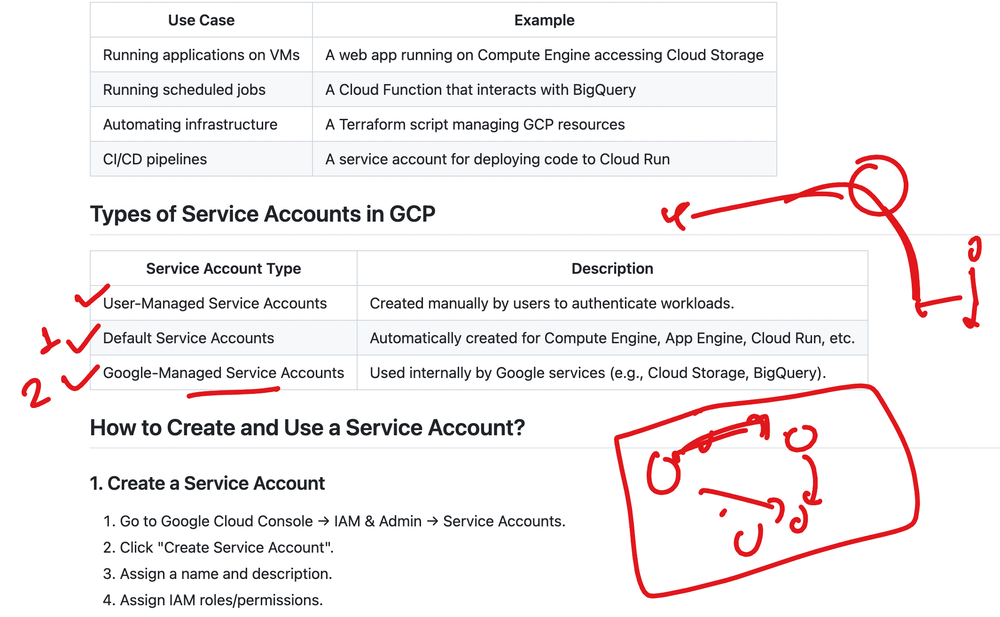

### Creating service account 

```sh
gcloud iam service-accounts create ashu-svc-new2 --project=vodafone-devsecops
```

### Task 1

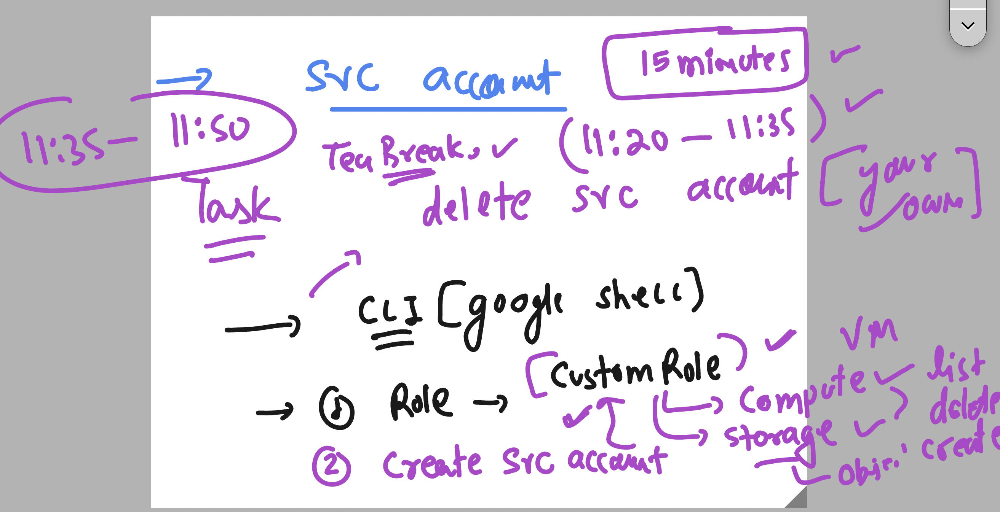

### Adding a predefine role to service account 

```sh
gcloud projects add-iam-policy-binding vodafone-devsecops --role="roles/compute.viewer" --member="serviceAccount:ashu-svc-new2@vodafone-devsecops.iam.gserviceaccount.com"
```

### Creating custom role and binding to service account 

```sh
gcloud iam roles create ashuCustomRole --project=vodafone-devsecops --title="compute engine roles permission" --permissions=compute.instances.create,compute.instances.delete,compute.instances.start  

# Bind the custom role to the service account
gcloud projects add-iam-policy-binding vodafone-devsecops --role="projects/vodafone-devsecops/roles/ashuCustomRole" --member="serviceAccount:ashu-svc-new2@vodafone-devsecops.iam.gserviceaccount.com"
```

### IAM Views 

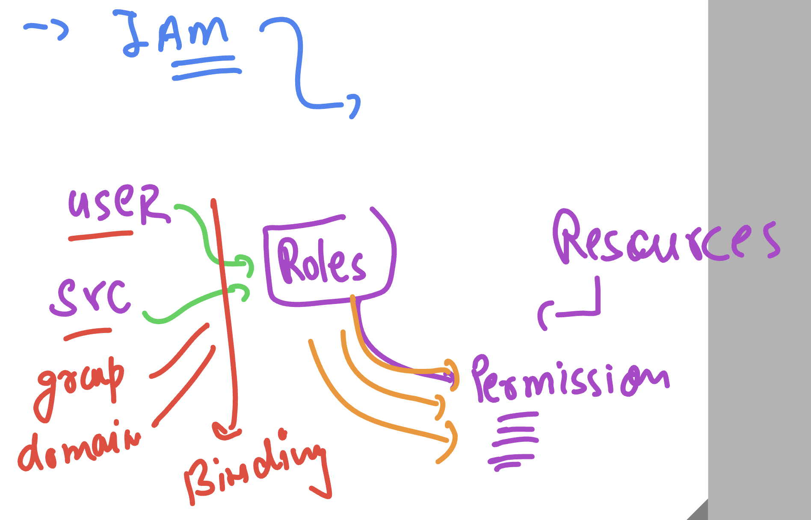

### Storage Info 

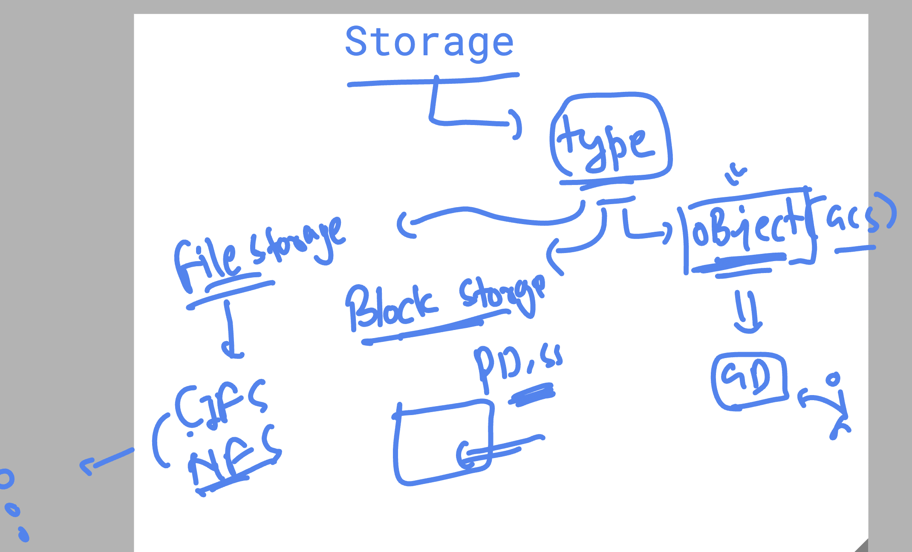

### Data Security in General Need Cryptographic Keys Support 


## Basic Cryptography

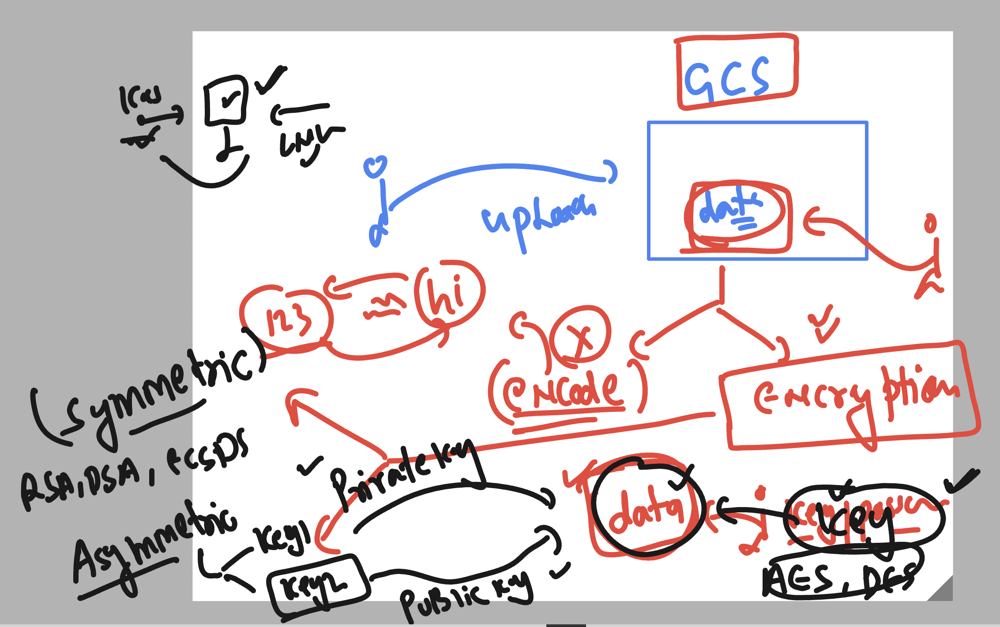

#### Google Cloud KMS Info 

Google Cloud Key Management Service (KMS) is a cloud-based service that allows you to manage encryption keys for your Google Cloud services. It provides a centralized way to create, use, rotate, and destroy cryptographic keys, ensuring that your data is securely encrypted both at rest and in transit. Let’s dive deep into Google Cloud KMS, covering its features, use cases, and how to use it effectively.

1. **What is Google Cloud KMS?**  
    Google Cloud KMS is a fully managed service that enables you to:
    - Create and manage cryptographic keys (symmetric and asymmetric).
    - Encrypt and decrypt data using these keys.
    - Integrate with other Google Cloud services (e.g., Cloud Storage, BigQuery, Compute Engine) to encrypt data.
    - Control access to keys using IAM policies.
    - Audit key usage using Cloud Audit Logs.

2. **Key Concepts**  
    a. **Key**  
        A key is a cryptographic object used for encryption, decryption, signing, or verification. Keys can be:
        - **Symmetric:** Same key for encryption and decryption.
        - **Asymmetric:** Consists of a public and private key pair.

    b. **Key Ring**  
        A key ring is a logical grouping of keys. It is used to organize keys and manage access at the key ring level. Key rings are created in a specific location (e.g., global, us-central1).

    c. **CryptoKey**  
        A CryptoKey is a specific key within a key ring. It can be used for encryption, decryption, signing, or verification. CryptoKeys have a purpose:
        - **ENCRYPT_DECRYPT:** For symmetric encryption/decryption.
        - **ASYMMETRIC_SIGN:** For asymmetric signing.
        - **ASYMMETRIC_DECRYPT:** For asymmetric decryption.


## Introduction to containers  -- for modern application build and run 


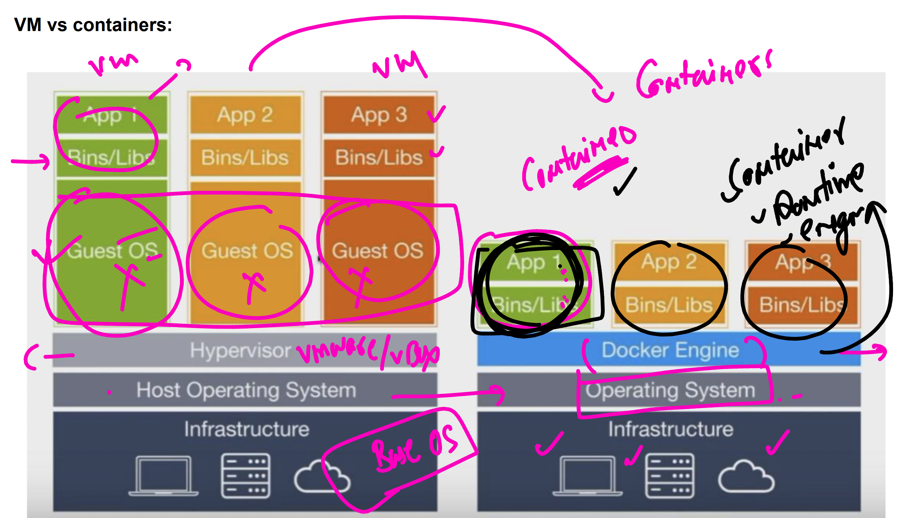

### link to install docker on Ubuntu VM 

[click_here](https://docs.docker.com/engine/install/ubuntu/)

### Container in a way 

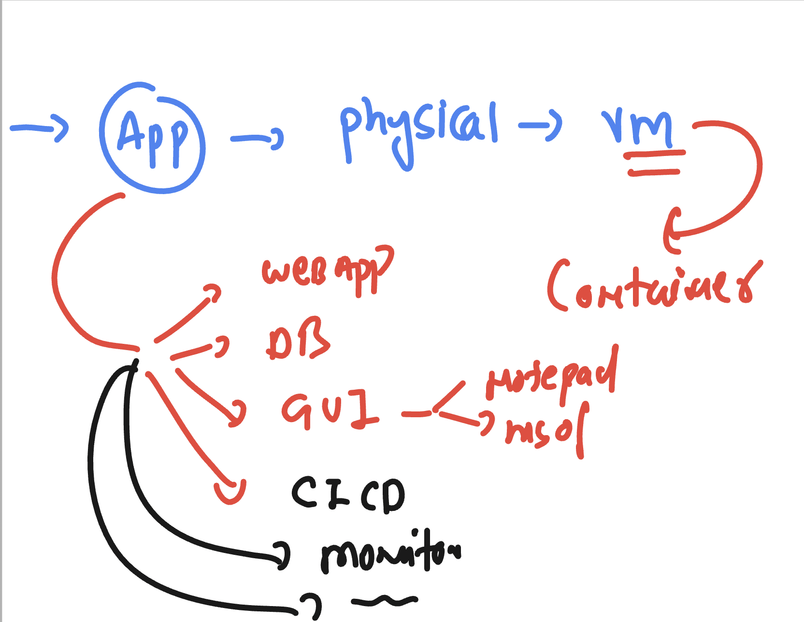

### Checking docker platform version 

```sh
docker  version 
Client: Docker Engine - Community
 Version:           28.0.0
 API version:       1.48
 Go version:        go1.23.6
 Git commit:        f9ced58
 Built:             Wed Feb 19 22:10:43 2025
 OS/Arch:           linux/amd64
 Context:           default

Server: Docker Engine - Community
 Engine:
  Version:          28.0.0
  API version:      1.48 (minimum version 1.24)
  Go version:       go1.23.6
  Git commit:       af898ab
  Built:            Wed Feb 19 22:10:43 2025
  OS/Arch:          linux/amd64
  Experimental:     false
 containerd:
  Version:          1.7.25
  GitCommit:        bcc810d6b9066471b0b6fa75f557a15a1cbf31bb
 runc:
  Version:          1.2.4
  GitCommit:        v1.2.4-0-g6c52b3f
 docker-init:
  Version:          0.19.0
  GitCommit:        de40ad0

```

### Docker images (libs/bin) 

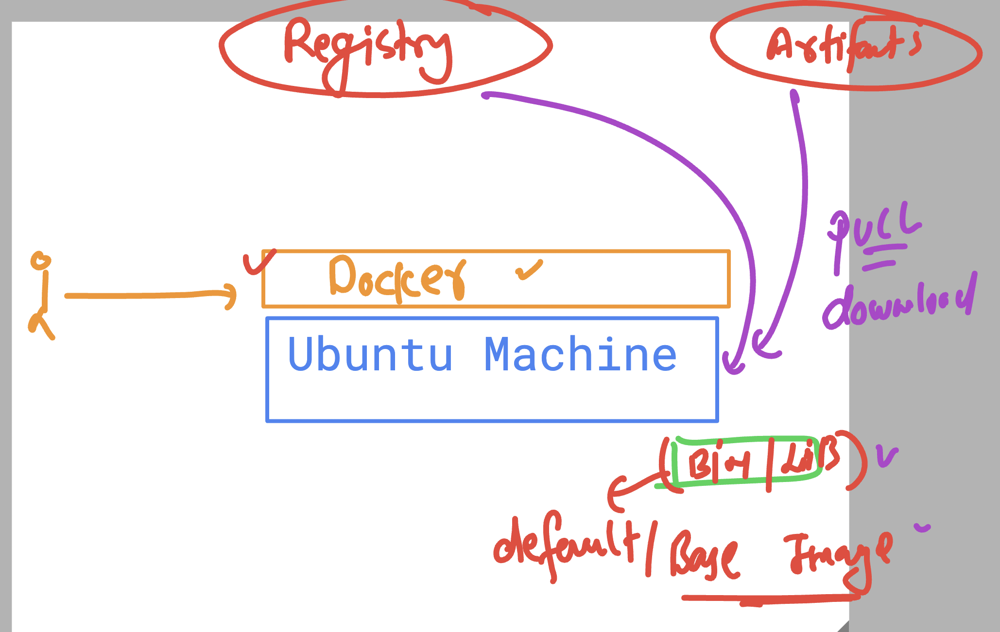


### list of present docker images in my server

```
docker  images
REPOSITORY    TAG       IMAGE ID       CREATED       SIZE
hello-world   latest    74cc54e27dc4   4 weeks ago   10.1kB
learntechbyme@gcp-common-vm:~$ 

```

### pulling image

```
 docker  pull  openjdk
Using default tag: latest
latest: Pulling from library/openjdk
197c1adcd755: Pull complete 
57b698b7af4b: Pull complete 
95a27dbe0150: Pull complete 
Digest: sha256:9b448de897d211c9e0ec635a485650aed6e28d4eca1efbc34940560a480b3f1f
Status: Downloaded newer image for openjdk:latest
docker.io/library/openjdk:latest
learntechbyme@gcp-common-vm:~$ docker  images
REPOSITORY    TAG       IMAGE ID       CREATED       SIZE
ubuntu        latest    a04dc4851cbc   4 weeks ago   78.1MB
hello-world   latest    74cc54e27dc4   4 weeks ago   10.1kB
openjdk       latest    71260f256d19   2 years ago   470MB
learntechbyme@gcp-common-vm:~$ 

```

### Build container images with apps and run them to create containers

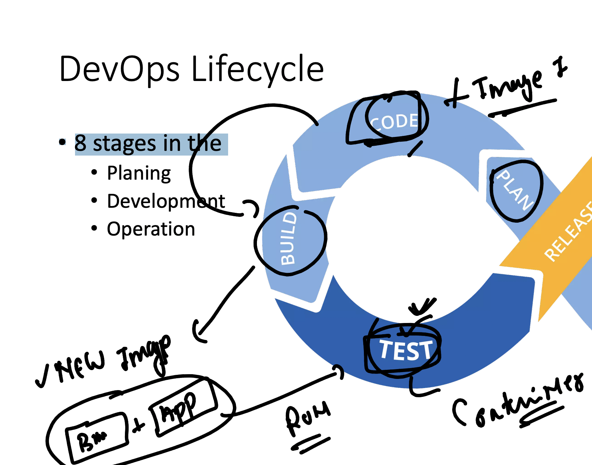

### to build container images we are going to use some image builder 

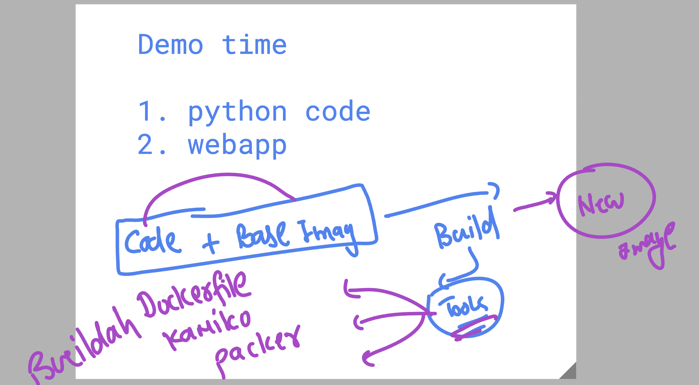

### Dockerfile Demo of python 

```dockerfile 
FROM  python
# pulling image from docker hub 
RUN mkdir  /ashucode
# creating directory inside new container image
COPY  ashu.py /ashucode/
# copy the code to new container image 
CMD  ["python","/ashucode/ashu.py"]
# setting options to run this code automatically when someone create container from this image
```

### building container image

```sh
learntechbyme@cloudshell:~$ ls
ashu.py  Dockerfile  README-cloudshell.txt
learntechbyme@cloudshell:~$ docker  build  -t   ashupython:codev1  . 
[+] Building 13.9s (4/7)                                                                                                                              docker:default
 => => transferring dockerfile: 350B                                                                                                                            0.0s
 => [internal] load metadata for docker.io/library/python:latest                                                                                                2.7s
 => [internal] load .dockerignore                                                                                                                               0.0s
 => => transferring context: 2B                                                                                                                                 0.0s
 => [1/3] FROM docker.io/library/python:latest@sha256:c32aeafeda56c09a4220b2b56d49d5efd0d803c302abdd5643b0bddb7ccd57aa                                         11.2s
 => => resolve docker.io/library/python:latest@sha256:c32

 ```

 ### creating contaienr , list , check logs 

 ```
 learntechbyme@cloudshell:~$ docker  run  --name  ashuc1  -itd  ashupython:codev1 

f9684afa8d71750a0fedec1c45f62648f54280c18693bc5f13086d0aceca7c76

learntechbyme@cloudshell:~$ docker  ps
CONTAINER ID   IMAGE               COMMAND                  CREATED         STATUS         PORTS     NAMES
f9684afa8d71   ashupython:codev1   "python /ashucode/as…"   4 seconds ago   Up 3 seconds             ashuc1

learntechbyme@cloudshell:~$ 
learntechbyme@cloudshell:~$ 
learntechbyme@cloudshell:~$ docker logs  ashuc1
Hello all , welcome to python..!!
Welcome to Vodafone ..
Welcome to Containers ..!!
______________________
Hello all , welcome to python..!!
Welcome to Vodafone ..

```

### checking container resources consumption 

```
docker  stats ashuc1 

```
### stopping container manually 

```
 docker  stop  ashuc1

ashuc1
learntechbyme@cloudshell:~$ docker  ps
CONTAINER ID   IMAGE     COMMAND   CREATED   STATUS    PORTS     NAMES
learntechbyme@cloudshell:~$ 

```

### default apache2 image demo 

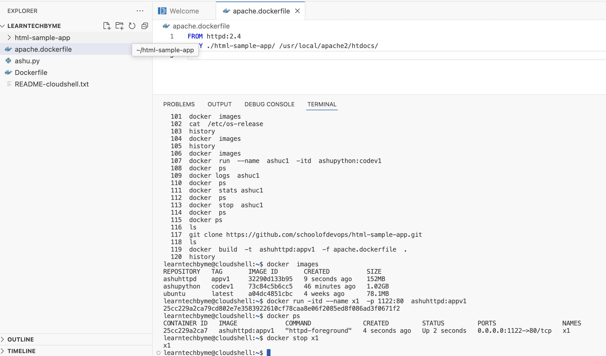


