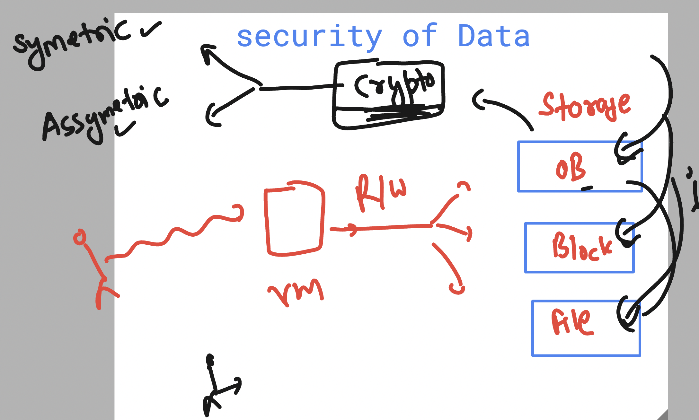

# vodafone_gcp_devsecops24thFeb2025

### Service account in GCP 


### Creating service account 

```sh
gcloud iam service-accounts create ashu-svc-new2 --project=vodafone-devsecops
```

### Task 1


### Adding a predefine role to service account 

```sh
gcloud projects add-iam-policy-binding vodafone-devsecops --role="roles/compute.viewer" --member="serviceAccount:ashu-svc-new2@vodafone-devsecops.iam.gserviceaccount.com"
```

### Creating custom role and binding to service account 

```sh
gcloud iam roles create ashuCustomRole --project=vodafone-devsecops --title="compute engine roles permission" --permissions=compute.instances.create,compute.instances.delete,compute.instances.start  

# Bind the custom role to the service account
gcloud projects add-iam-policy-binding vodafone-devsecops --role="projects/vodafone-devsecops/roles/ashuCustomRole" --member="serviceAccount:ashu-svc-new2@vodafone-devsecops.iam.gserviceaccount.com"
```

### IAM Views 


### Storage Info 


### Data Security in General Need Cryptographic Keys Support 



## Basic Cryptography


#### Google Cloud KMS Info 

Google Cloud Key Management Service (KMS) is a cloud-based service that allows you to manage encryption keys for your Google Cloud services. It provides a centralized way to create, use, rotate, and destroy cryptographic keys, ensuring that your data is securely encrypted both at rest and in transit. Let’s dive deep into Google Cloud KMS, covering its features, use cases, and how to use it effectively.

1. **What is Google Cloud KMS?**  
    Google Cloud KMS is a fully managed service that enables you to:
    - Create and manage cryptographic keys (symmetric and asymmetric).
    - Encrypt and decrypt data using these keys.
    - Integrate with other Google Cloud services (e.g., Cloud Storage, BigQuery, Compute Engine) to encrypt data.
    - Control access to keys using IAM policies.
    - Audit key usage using Cloud Audit Logs.

2. **Key Concepts**  
    a. **Key**  
        A key is a cryptographic object used for encryption, decryption, signing, or verification. Keys can be:
        - **Symmetric:** Same key for encryption and decryption.
        - **Asymmetric:** Consists of a public and private key pair.

    b. **Key Ring**  
        A key ring is a logical grouping of keys. It is used to organize keys and manage access at the key ring level. Key rings are created in a specific location (e.g., global, us-central1).

    c. **CryptoKey**  
        A CryptoKey is a specific key within a key ring. It can be used for encryption, decryption, signing, or verification. CryptoKeys have a purpose:
        - **ENCRYPT_DECRYPT:** For symmetric encryption/decryption.
        - **ASYMMETRIC_SIGN:** For asymmetric signing.
        - **ASYMMETRIC_DECRYPT:** For asymmetric decryption.


## Introduction to containers  -- for modern application build and run 


### link to install docker on Ubuntu VM 

[click_here](https://docs.docker.com/engine/install/ubuntu/)

