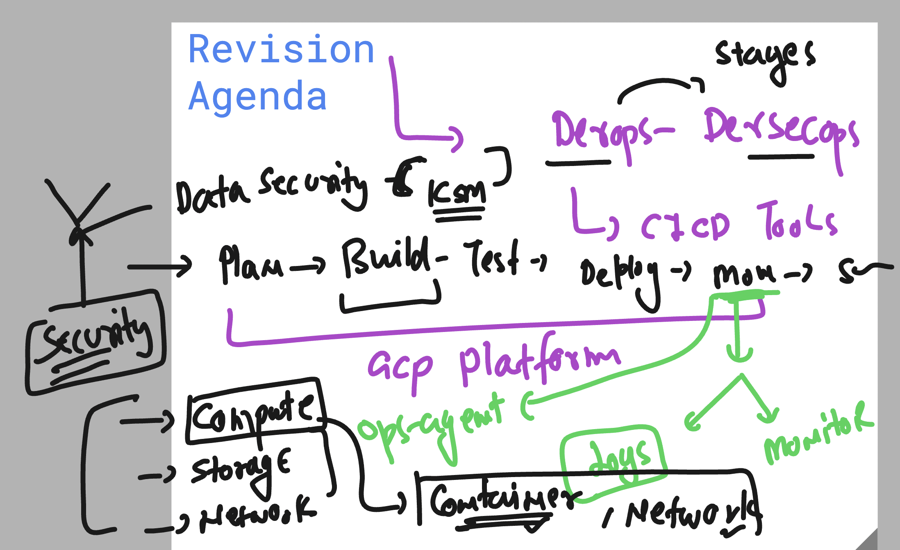
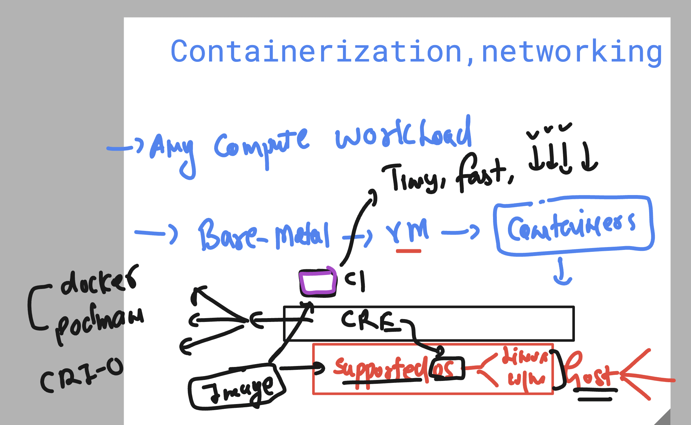
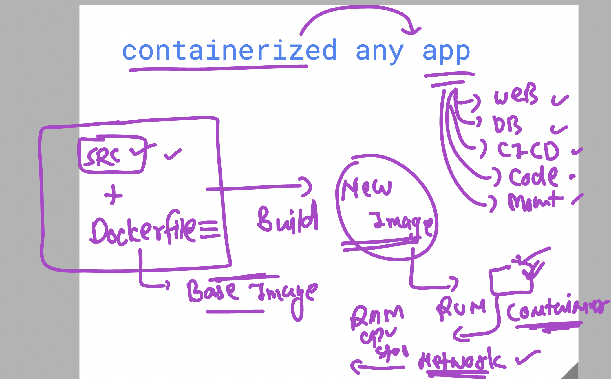
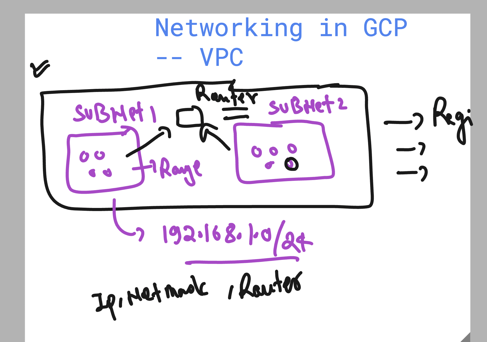
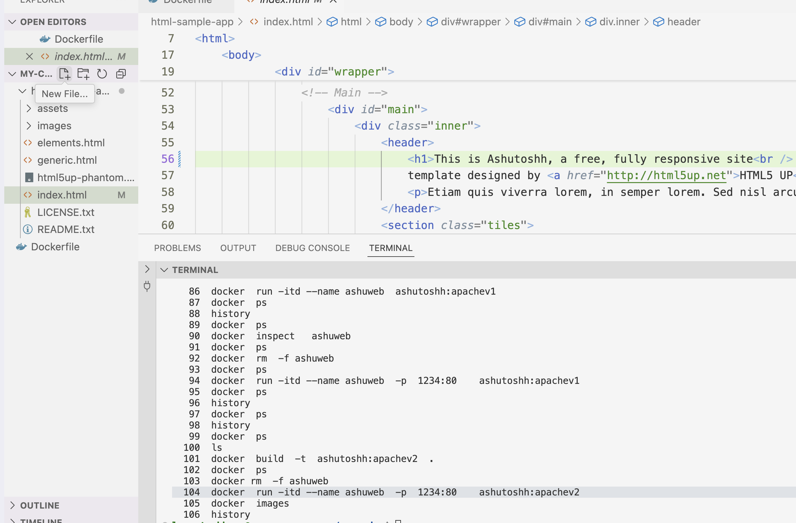
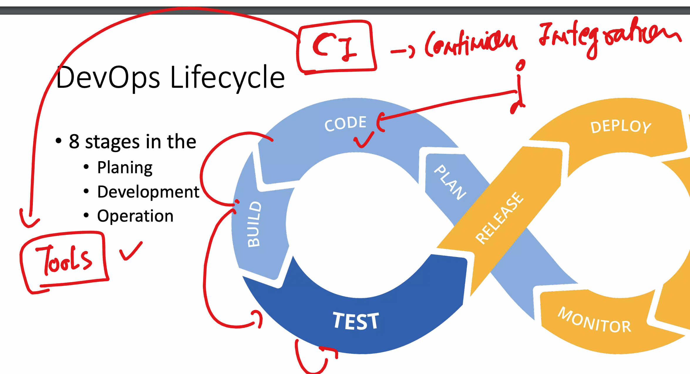
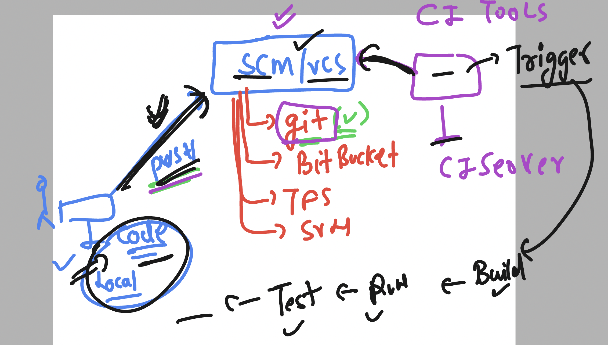
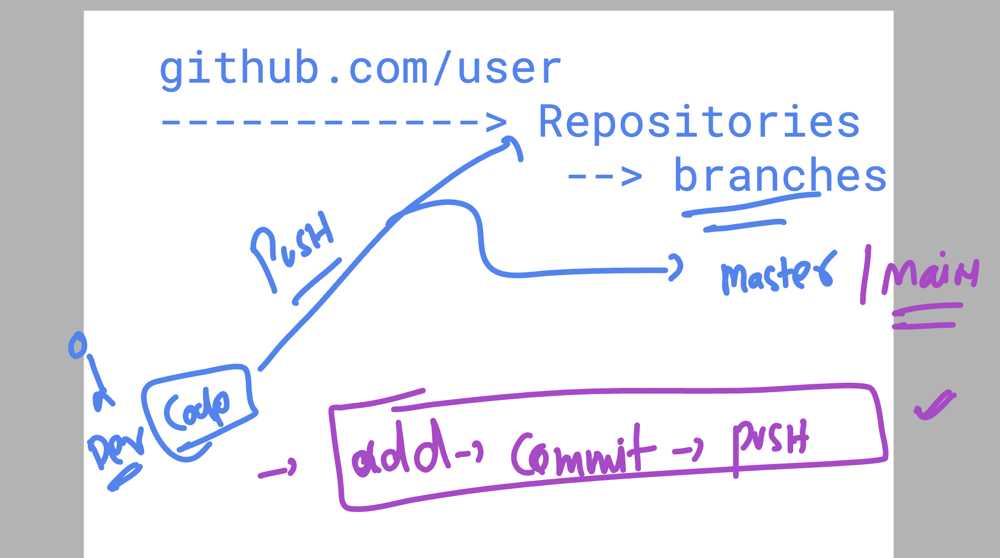
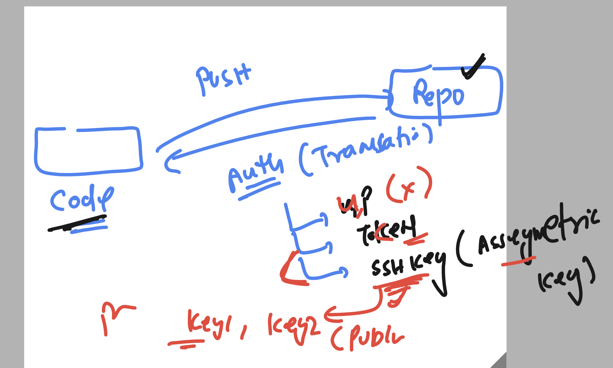

### Revision basic 



### Container revision 



### Container image build and run process



### Network info 



### Creating webapp container and access it as user 

### cloning sample code 

```
git  clone   https://github.com/schoolofdevops/html-sample-app.git
```

### Write dockerfile and build the image

```
learntechbyme@gcp-common-vm:~/my-codes$ ls
Dockerfile  html-sample-app
learntechbyme@gcp-common-vm:~/my-codes$ 
learntechbyme@gcp-common-vm:~/my-codes$ docker  build  -t  ashutoshh:apachev1  . 
2025/02/26 07:13:46 in: []string{}
2025/02/26 07:13:46 Parsed entitlements: []

```

### creating container and checking networking details 

```sh
docker  run -itd --name ashuweb  ashutoshh:apachev1 
b0433754345b959fc76623df1b409c93b70c1305c86b988d0aa4c14bac71dd1f
learntechbyme@gcp-common-vm:~/my-codes$ docker  ps
CONTAINER ID   IMAGE                COMMAND              CREATED          STATUS         PORTS     NAMES
b0433754345b   ashutoshh:apachev1   "httpd-foreground"   10 seconds ago   Up 9 seconds   80/tcp    ashuweb
learntechbyme@gcp-common-vm:~/my-codes$ 

```

### Recreating container with port mapping 

```
docker  rm  -f ashuweb  
ashuweb

learntechbyme@gcp-common-vm:~/my-codes$ docker  ps
CONTAINER ID   IMAGE                 COMMAND              CREATED              STATUS              PORTS     NAMES
c468918db995   sohail:apachev1       "httpd-foreground"   About a minute ago   Up About a minute   80/tcp    sohailweb
73802fd6be9e   somningshh:apachev1   "httpd-foreground"   6 minutes ago        Up 6 minutes        80/tcp    somningweb
30f7e834acea   aniketshh:apachev1    "httpd-foreground"   7 minutes ago        Up 7 minutes        80/tcp    aniketweb
0734d873089e   pradip:apachev1       "httpd-foreground"   7 minutes ago        Up 7 minutes        80/tcp    pradipweb
1d7948b120a1   anantha:httpd-v1      "httpd-foreground"   7 minutes ago        Up 7 minutes        80/tcp    Container-Anantha
b6e129e3d43a   anuj:apachev1         "httpd-foreground"   7 minutes ago        Up 7 minutes        80/tcp    anujweb


learntechbyme@gcp-common-vm:~/my-codes$ docker  run -itd --name ashuweb  -p  1234:80    ashutoshh:apachev1 
9d71f908ff2f7431acb176bbcdf248370555eda2e011235c7c7f4eba051320fc
learntechbyme@gcp-common-vm:~/my-codes$ docker  ps
CONTAINER ID   IMAGE                 COMMAND              CREATED          STATUS          PORTS                                     NAMES
9d71f908ff2f   ashutoshh:apachev1    "httpd-foreground"   3 seconds ago    Up 2 seconds    0.0.0.0:1234->80/tcp, [::]:1234->80/tcp   ashuweb
fb92de60dc59   anantha:httpd-v1      "httpd-foreground"   49 seconds ago   Up 48 seconds   0.0.0.0:8081->80/tcp, [::]:8081->80/tcp   AnanthaWeb2
c468918db995   sohail:apachev1       "httpd-foreground"   2 minutes ago    Up 2 minutes    80/tcp                                    sohailweb
73802fd6be9e   somningshh:apachev1   "httpd-foreground"   8 minutes ago    Up 8 minutes    80/tcp                                    somningweb
30f7e834acea   aniketshh:apachev1    "httpd-foreground"   8 minutes ago    Up 8 minutes    80/tcp       

```

### Updataing app code 



## CI process 



### More detail info about CI process and Trigger as well



### info about Github Repo 



### secure auth in github repo and code system 



### generating ssh-keys for secure communication to github repo 

```
ssh-keygen 
Generating public/private rsa key pair.
Enter file in which to save the key (/home/learntechbyme/.ssh/id_rsa): 
Enter passphrase (empty for no passphrase): 
Enter same passphrase again: 
Your identification has been saved in /home/learntechbyme/.ssh/id_rsa
Your public key has been saved in /home/learntechbyme/.ssh/id_rsa.pub
The key fingerprint is:
SHA256:NpHGY0n2NbfDObxgOw9hypJGRNVhYAn98hTH6dHUzlE learntechbyme@gcp-common-vm
The key's randomart image is:
+---[RSA 3072]----+
|       .*+++=o.+E|
|       = =ooo==+o|
|        X ..=+B+.|

```


### pushing to github repo 

```
 ls
Dockerfile  README.md  html-sample-app
learntechbyme@gcp-common-vm:~/my-codes/ashu-vodafone-webapp$ 
learntechbyme@gcp-common-vm:~/my-codes/ashu-vodafone-webapp$ 
learntechbyme@gcp-common-vm:~/my-codes/ashu-vodafone-webapp$ git add  .
warning: adding embedded git repository: html-sample-app
hint: You've added another git repository inside your current repository.
hint: Clones of the outer repository will not contain the contents of
hint: the embedded repository and will not know how to obtain it.
hint: If you meant to add a submodule, use:
hint: 
hint:   git submodule add <url> html-sample-app
hint: 
hint: If you added this path by mistake, you can remove it from the
hint: index with:
hint: 
hint:   git rm --cached html-sample-app
hint: 
hint: See "git help submodule" for more information.
learntechbyme@gcp-common-vm:~/my-codes/ashu-vodafone-webapp$ git commit  -m "updates"
Author identity unknown

*** Please tell me who you are.

Run

  git config --global user.email "you@example.com"
  git config --global user.name "Your Name"

to set your account's default identity.
Omit --global to set the identity only in this repository.

fatal: empty ident name (for <learntechbyme@gcp-common-vm.asia-south1-c.c.vodafone-devsecops.internal>) not allowed

learntechbyme@gcp-common-vm:~/my-codes/ashu-vodafone-webapp$ git config --global user.email ashutoshh@linux.com
learntechbyme@gcp-common-vm:~/my-codes/ashu-vodafone-webapp$ git config --global user.name  redashu
learntechbyme@gcp-common-vm:~/my-codes/ashu-vodafone-webapp$ 
learntechbyme@gcp-common-vm:~/my-codes/ashu-vodafone-webapp$ git add  .
learntechbyme@gcp-common-vm:~/my-codes/ashu-vodafone-webapp$ git commit  -m "updates"
[master b4bffea] updates
 3 files changed, 6 insertions(+)
 create mode 100644 .gitignore
 create mode 100644 Dockerfile
 create mode 160000 html-sample-app
learntechbyme@gcp-common-vm:~/my-codes/ashu-vodafone-webapp$ git push 
Enumerating objects: 5, done.
Counting objects: 100% (5/5), done.
Delta compression using up to 4 threads
Compressing objects: 100% (3/3), done.
Writing objects: 100% (4/4), 448 bytes | 448.00 KiB/s, done.
Total 4 (delta 0), reused 0 (delta 0), pack-reused 0
To github.com:redashu/ashu-vodafone-webapp.git
   cbb46db..b4bffea  master -> master

```
