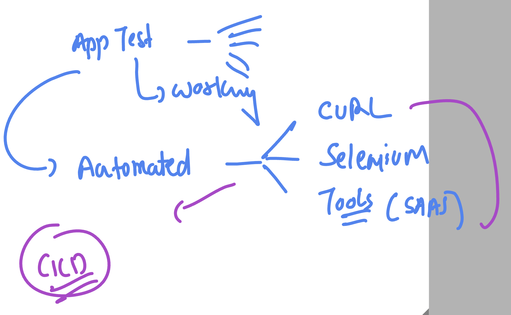

### Revision 

### Development to Deployment 


### CodeBuild option there 


### clone repo and change password 

```
earntechbyme@common-vm:~$ ls
ashu-vodafone-webapp  my-codes  vscode
learntechbyme@common-vm:~$ git clone git@github.com:redashu/ashu-vodafone-webapp.git^C
learntechbyme@common-vm:~$ 
learntechbyme@common-vm:~$ 
learntechbyme@common-vm:~$ sudo -i
root@common-vm:~# 
root@common-vm:~# passwd learntechbyme 
New password: 
Retype new password: 
passwd: password updated successfully
root@common-vm:~# 

```

### testing container app

```
docker run -itd --name ashuc1 -p 1234:80 ashu:app1
fbf41b5ae610e514473600887f181d1711d01849c7b6b6356c926605525a75dd
learntechbyme@common-vm:~/ashu-vodafone-webapp$ docker ps
CONTAINER ID   IMAGE       COMMAND              CREATED         STATUS         PORTS                                     NAMES
fbf41b5ae610   ashu:app1   "httpd-foreground"   3 seconds ago   Up 2 seconds   0.0.0.0:1234->80/tcp, [::]:1234->80/tcp   ashuc1
learntechbyme@common-vm:~/ashu-vodafone-webapp$ 


```

## webapp working / functional testing can be done using automation tools as well



### Understanding security context in Devops lifecycle 


### Understanding SAST thing


### Some SAST tools 


### TRrivy can scan below things for given targets


### trivy commands 

### scanning webapp source code 

```
trivy  fs  ./web-app/
2025-02-27T07:50:33Z    INFO    [vulndb] Need to update DB
2025-02-27T07:50:33Z    INFO    [vulndb] Downloading vulnerability DB...
2025-02-27T07:50:33Z    INFO    [vulndb] Downloading artifact...        repo="mirror.gcr.io/aquasec/trivy-db:2"
60.06 MiB / 60.06 MiB [------------------------------------------------------------------------] 100.00% 16.98 MiB p/s 3.7s
2025-02-27T07:50:38Z    INFO    [vulndb] Artifact successfully downloaded       repo="mirror.gcr.io/aquasec/trivy-db:2"
2025-02-27T07:50:38Z    INFO    [vuln] Vulnerability scanning is enabled
2025-02-27T07:50:38Z    INFO    [secret] Secret scanning is enabled
2025-02-27T07:50:38Z    INFO    [secret] If your scanning is slow, please try '--scanners vuln' to disable secret scanning
2025-02-27T07:50:38Z    INFO    [secret] Please see also https://aquasecurity.github.io/trivy/v0.59/docs/scanner/secret#recommendation for faster secret detection
2025-02-27T07:50:38Z    INFO    Number of language-specific files       num=0
learntechbyme@common-vm:~/ashu-vodafone-webapp$ 
learntechbyme@common-vm:~/ashu-vodafone-webapp$ 
learntechbyme@common-vm:~/ashu-vodafone-webapp$ 

```

### some more commands 

```
   90  ls
   91  trivy 
   92  trivy  repo https://github.com/redashu/vodafone_gcp_devsecops24thFeb2025.git
   93  ls
   94  trivy  image  python:3.4-alpine 
   95  history 
   96  trivy  image  gcr.io/cloud-builders/docker
   97  history 

   ```

   ### More trivy commands 

   ```
     101  trivy  image ashu:app1  >result.txt
  102  cat result.txt 
  103  history 
  104  trivy --help
  105  trivy  image  --severity HIGH  ashu:app1  
  106  trivy  image  --severity HIGH,CRITICAL  ashu:app1  
```

### few k8s components 


### setup k8s in General 

