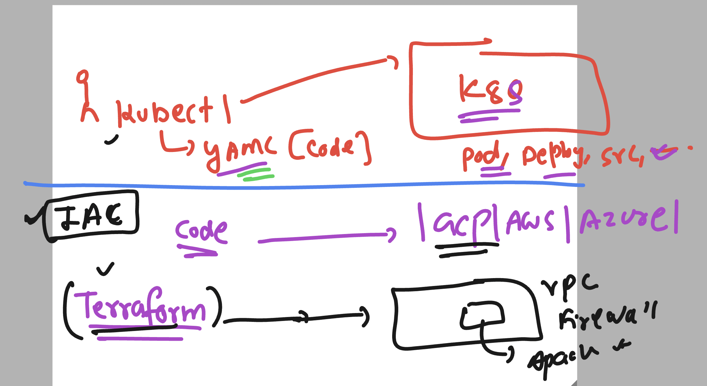

## Understanding Multi container image build and container create 


### Installing docker compose on gcp vm 

```
on-vm:~$ sudo -i
root@common-vm:~#  curl -SL https://github.com/docker/compose/releases/download/v2.33.1/docker-compose-linux-x86_64 -o /usr/bin/docker-compose
  % Total    % Received % Xferd  Average Speed   Time    Time     Time  Current
                                 Dload  Upload   Total   Spent    Left  Speed
  0     0    0     0    0     0      0      0 --:--:-- --:--:-- --:--:--     0
100 70.2M  100 70.2M    0     0  32.0M      0  0:00:02  0:00:02 --:--:-- 99.6M
root@common-vm:~# 
root@common-vm:~# 
root@common-vm:~# chmod  +x /usr/bin/docker-compose  
root@common-vm:~# docker-compose  version 
Docker Compose version v2.33.1
root@common-vm:~# 


```

### compose yaml file 

```yaml
services:
  ashu-python-app:
  # image we want to build 
    image: ashu-pyapp:samplev1
    # location and name of Dockerfile  
    build:
      context: ./pyapp
      dockerfile: Dockerfile  
  ashu-web-app:
    image: ashu-webapp:samplev1 
    build: . 
```
### to build 
```sh
docker-compose build 
```

### K8s quick revision 


### getting credentails of GEK -- control plane 


### To get GKE control plane credentials from gcloud shell

```
gcloud container clusters get-credentials my-first-cluster-1 --zone us-central1-c --project vodafone-devsecops 

```

### connection verification 

```
learntechbyme@cloudshell:~ (vodafone-devsecops)$ kubectl version 
Client Version: v1.29.13
Kustomize Version: v5.0.4-0.20230601165947-6ce0bf390ce3
Server Version: v1.29.13-gke.1169000
learntechbyme@cloudshell:~ (vodafone-devsecops)$ kubectl version  -o yaml 
clientVersion:
  buildDate: "2025-01-15T14:43:02Z"
  compiler: gc
  gitCommit: 9a58e9398d4aa69d7ad40f40407e54b96025e0c5
  gitTreeState: clean
  gitVersion: v1.29.13
  goVersion: go1.22.10
  major: "1"
  minor: "29"
  platform: linux/amd64
kustomizeVersion: v5.0.4-0.20230601165947-6ce0bf390ce3
serverVersion:
  buildDate: "2025-02-03T04:19:49Z"
  compiler: gc
  gitCommit: b4e8a905b211e97a81bbfe41602017d9a5bfef1c
  gitTreeState: clean
  gitVersion: v1.29.13-gke.1169000
  goVersion: go1.22.10 X:boringcrypto

```

## Few kubectl commands 

### Getting nodes detail 

```
 kubectl   get  nodes
NAME                                                STATUS   ROLES    AGE    VERSION
gke-my-first-cluster-1-default-pool-91a71bd3-j52c   Ready    <none>   110m   v1.29.13-gke.1169000
gke-my-first-cluster-1-default-pool-91a71bd3-w30p   Ready    <none>   110m   v1.29.13-gke.1169000
gke-my-first-cluster-1-default-pool-91a71bd3-wfzk   Ready    <none>   110m   v1.29.13-gke.1169000
learntechbyme@cloudshell:~ (vodafone-devsecops)$ 

```

### POd as basic unit in k8s -- to deploy any container image


### creating first pod 

```
learntechbyme@cloudshell:~ (vodafone-devsecops)$ kubectl  get  pods
No resources found in default namespace.
learntechbyme@cloudshell:~ (vodafone-devsecops)$ 
learntechbyme@cloudshell:~ (vodafone-devsecops)$ 
learntechbyme@cloudshell:~ (vodafone-devsecops)$ kubectl  run  ashupod1  --image  nginx  
pod/ashupod1 created
learntechbyme@cloudshell:~ (vodafone-devsecops)$ kubectl   get  nodes
NAME                                                STATUS   ROLES    AGE    VERSION
gke-my-first-cluster-1-default-pool-91a71bd3-j52c   Ready    <none>   124m   v1.29.13-gke.1169000
gke-my-first-cluster-1-default-pool-91a71bd3-w30p   Ready    <none>   124m   v1.29.13-gke.1169000
gke-my-first-cluster-1-default-pool-91a71bd3-wfzk   Ready    <none>   124m   v1.29.13-gke.1169000
learntechbyme@cloudshell:~ (vodafone-devsecops)$ 
learntechbyme@cloudshell:~ (vodafone-devsecops)$ 
learntechbyme@cloudshell:~ (vodafone-devsecops)$ kubectl  get  pods
NAME       READY   STATUS    RESTARTS   AGE
ashupod1   1/1     Running   0          48s
learntechbyme@cloudshell:~ (vodafone-devsecops)$ kubectl  get  pods -o wide
NAME       READY   STATUS    RESTARTS   AGE   IP          NODE                                                NOMINATED NODE   READINESS GATES
ashupod1   1/1     Running   0          58s   10.48.0.6   gke-my-first-cluster-1-default-pool-91a71bd3-w30p   <none>           <none>
learntechbyme@cloudshell:~ (vodafone-devsecops)$ 

```

## always created pod using controllers not direct 


### cleaning up the pods

```
kubectl delete pods --all
pod "anantha" deleted
pod "aniketpod" deleted
pod "anujpod1" deleted
pod "ashupod1" deleted
pod "pradippod1" deleted

```

### creating pods using deployment controller 

```
 kubectl   create  deployment  ashu-app-deploy  --image  nginx  --port 80   --dry-run=client -o yaml 
apiVersion: apps/v1
kind: Deployment
metadata:
  creationTimestamp: null
  labels:
    app: ashu-app-deploy
  name: ashu-app-deploy
spec:
  replicas: 1
  selector:
    matchLabels:
      app: ashu-app-deploy
  strategy: {}
  template:
    metadata:
      creationTimestamp: null
      labels:
        app: ashu-app-deploy
    spec:
      containers:
      - image: nginx
        name: nginx
        ports:
        - containerPort: 80
        resources: {}
status: {}
learntechbyme@cloudshell:~ (vodafone-devsecops)$ kubectl   create  deployment  ashu-app-deploy  --image  nginx  --port 80   --dry-run=client -o yaml  >deploy.yaml 
learntechbyme@cloudshell:~ (vodafone-devsecops)$ 


```

### deploy pod with yaml file using deployment 

```
 kubectl  create  -f  deploy.yaml 
deployment.apps/ashu-app-deploy created
learntechbyme@cloudshell:~ (vodafone-devsecops)$ kubectl get deploy 
NAME              READY   UP-TO-DATE   AVAILABLE   AGE
ashu-app-deploy   1/1     1            1           8s
learntechbyme@cloudshell:~ (vodafone-devsecops)$ kubectl get pod
NAME                               READY   STATUS    RESTARTS   AGE
ashu-app-deploy-64d7596cbc-vprs8   1/1     Running   0          19s
learntechbyme@cloudshell:~ (vodafone-devsecops)$ 

```

### scaling pod horizontally using yaml file update

```
kubectl apply   -f deploy.yaml 
Warning: resource deployments/ashu-app-deploy is missing the kubectl.kubernetes.io/last-applied-configuration annotation which is required by kubectl apply. kubectl apply should only be used on resources created declaratively by either kubectl create --save-config or kubectl apply. The missing annotation will be patched automatically.
deployment.apps/ashu-app-deploy configured
learntechbyme@cloudshell:~ (vodafone-devsecops)$ 
learntechbyme@cloudshell:~ (vodafone-devsecops)$ kubectl get  deploy
NAME                 READY   UP-TO-DATE   AVAILABLE   AGE
anantha-app-deploy   1/1     1            1           4m21s
aniket-app-deploy    1/1     1            1           4m30s
anuj-app-deploy      1/1     1            1           87s
ashu-app-deploy      2/2     2            2           10m
pradip-app-deploy    1/1     1            1           6m34s
sohl-app-deploy      1/1     1            1           5m40s
somning-app-deploy   1/1     1            1           7m39s
learntechbyme@cloudshell:~ (vodafone-devsecops)$ kubectl get po
NAME                                  READY   STATUS    RESTARTS   AGE
anantha-app-deploy-55fd69f5c9-pgzg9   1/1     Running   0          2m26s
aniket-app-deploy-55c5f8cf58-64kj8    1/1     Running   0          4m43s
anuj-app-deploy-6d8fc6fd9b-bnnbd      1/1     Running   0          100s
ashu-app-deploy-64d7596cbc-fk7d2      1/1     Running   0          17s
ashu-app-deploy-64d7596cbc-hd2tb      1/1     Running   0          2m25s
pradip-app-deploy-69f68596f8-g7pb2    1/1     Running   0          6m47s
sohl-app-deploy-59b5dbfbb6-fmq2v      1/1     Running   0          5m53s

```

### cleanup of deployment 

```
       11m
learntechbyme@cloudshell:~ (vodafone-devsecops)$ kubectl delete -f deploy.yaml 
deployment.apps "ashu-app-deploy" deleted
learntechbyme@cloudshell:~ (vodafone-devsecops)$ kubectl get  deploy                                                                                                               
NAME                 READY   UP-TO-DATE   AVAILABLE   AGE
anantha-app-deploy   3/3     3            3           10m
aniket-app-deploy    1/1     1            1           10m
anuj-app-deploy      1/1     1            1           7m14s
pradip-app-deploy    2/2     2            2           12m
sohl-app-deploy      2/2     2            2           11m

```

### More tool info about SAST and DAST 


### IAC for NON K8s infra for any Cloud -- Terraform 


### Terraform tool as INfra provisinoer 



### checking terraform version 

```
 terraform  version 
Terraform v1.5.7
on linux_amd64

Your version of Terraform is out of date! The latest version
is v1.11.0. You can update by downloading from https://www.terraform.io/downloads.html
learntechbyme@cloudshell:~ (vodafone-devsecops)$ 

```

### More info about HashiCorp Terraform 


### Creating Infra 


### INit 

```
terraform init 

Initializing the backend...

Initializing provider plugins...
- Finding latest version of hashicorp/google...
- Installing hashicorp/google v6.23.0...
- Installed hashicorp/google v6.23.0 (signed by HashiCorp)

Terraform has created a lock file .terraform.lock.hcl to record the provider
selections it made above. Include this file in your version control repository
so that Terraform can guarantee to make the same selections by defaul

```

### Plan --apply -- > Destroy 

```
learntechbyme@cloudshell:~/ashu-terraform$ terraform init  ^C
learntechbyme@cloudshell:~/ashu-terraform$ terraform plan 

No changes. Your infrastructure matches the configuration.

Terraform has compared your real infrastructure against your configuration and found no differences, so no changes are needed.
learntechbyme@cloudshell:~/ashu-terraform$ terraform  apply 

No changes. Your infrastructure matches the configuration.

Terraform has compared your real infrastructure against your configuration and found no differences, so no changes are needed.

Apply complete! Resources: 0 added, 0 changed, 0 destroyed.
learntechbyme@cloudshell:~/ashu-terraform$ 
learntechbyme@cloudshell:~/ashu-terraform$ terraform  destroy 

No changes. No objects need to be destroyed.

Either you have not created any objects yet or the existing objects were already deleted outside of Terraform.

Destroy complete! Resources: 0 destroyed.
learntechbyme@cloudshell:~/ashu-terraform$ 
```

### DAST is possible when we are exposing our app to be accessible range 


### k8s based pod apss can be exposed using LB which can be created by service controller


### Creating loadbalancer type service 

```
 kubectl expose deployment aniket-app-deploy  --type LoadBalancer  --port 80 --dry-run=client -o yaml >anksvc.yaml 
  239  cat anksvc.yaml 
  240  history 
learntechbyme@cloudshell:~ (vodafone-devsecops)$ kubectl create -f anksvc.yaml 
service/aniket-app-deploy created
learntechbyme@cloudshell:~ (vodafone-devsecops)$ kubectl get  service 
NAME                TYPE           CLUSTER-IP       EXTERNAL-IP    PORT(S)        AGE
aniket-app-deploy   LoadBalancer   34.118.234.111   <pending>      80:31459/TCP   7s
ashu-app-deploy     LoadBalancer   34.118.236.71    34.66.64.221   80:30950/TCP   51m
kubernetes          ClusterIP      34.118.224.1     <none>         443/TCP        7h32m
learntechbyme@cloudshell:~ (vodafone-devsecops)$ kubectl get  service 
NAME                TYPE           CLUSTER-IP       EXTERNAL-IP    PORT(S)        AGE
aniket-app-deploy   LoadBalancer   34.118.234.111   <pending>      80:31459/TCP   25s
ashu-app-deploy     LoadBalancer   34.118.236.71    34.66.64.221   80:30950/TCP   52m
kubernetes          ClusterIP      34.118.224.1     <none>         443/TCP        7h32m
learntechbyme@cloudshell:~ (vodafone-devsecops)$ kubectl get  deploy
NAME                 READY   UP-TO-DATE   AVAILABLE   AGE
aniket-app-deploy    2/2     2            2           3h43m
ashu-app-deploy      1/1     1            1           3h45m
pradip-app-deploy    1/1     1            1           3h45m
sohl-app-deploy      1/1     1            1           3h47m
somning-app-deploy   1/1     1            1           3h45m
learntechbyme@cloudshell:~ (vodafone-devsecops)$ 

```

### scanning any realtime webapp

```
docker run -t zaproxy/zap-weekly zap-baseline.py -t  http://34.66.64.221/ 
```
